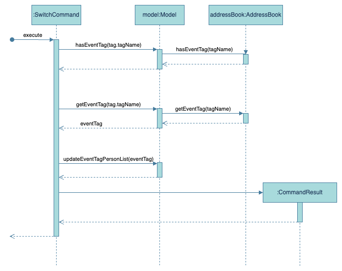

# EventBook Developer Guide

<!-- * Table of Contents -->
<page-nav-print />

--------------------------------------------------------------------------------------------------------------------

## **Acknowledgements**

_{ list here sources of all reused/adapted ideas, code, documentation, and third-party libraries -- include links to the original source as well }_

--------------------------------------------------------------------------------------------------------------------

## **Setting up, getting started**

Refer to the guide [_Setting up and getting started_](SettingUp.md).

--------------------------------------------------------------------------------------------------------------------

## **Design**

### Architecture

<puml src="diagrams/ArchitectureDiagram.puml" width="280" />

The ***Architecture Diagram*** given above explains the high-level design of the App.

Given below is a quick overview of main components and how they interact with each other.

**Main components of the architecture**

**`Main`** (consisting of classes [`Main`](https://github.com/se-edu/addressbook-level3/tree/master/src/main/java/seedu/address/Main.java) and [`MainApp`](https://github.com/se-edu/addressbook-level3/tree/master/src/main/java/seedu/address/MainApp.java)) is in charge of the app launch and shut down.
* At app launch, it initializes the other components in the correct sequence, and connects them up with each other.
* At shut down, it shuts down the other components and invokes cleanup methods where necessary.

The bulk of the app's work is done by the following four components:

* [**`UI`**](#ui-component): The UI of the App.
* [**`Logic`**](#logic-component): The command executor.
* [**`Model`**](#model-component): Holds the data of the App in memory.
* [**`Storage`**](#storage-component): Reads data from, and writes data to, the hard disk.

[**`Commons`**](#common-classes) represents a collection of classes used by multiple other components.

**How the architecture components interact with each other**

The *Sequence Diagram* below shows how the components interact with each other for the scenario where the user issues the command `delete 1`.

<puml src="diagrams/ArchitectureSequenceDiagram.puml" width="574" />

Each of the four main components (also shown in the diagram above),

* defines its *API* in an `interface` with the same name as the Component.
* implements its functionality using a concrete `{Component Name}Manager` class (which follows the corresponding API `interface` mentioned in the previous point.

For example, the `Logic` component defines its API in the `Logic.java` interface and implements its functionality using the `LogicManager.java` class which follows the `Logic` interface. Other components interact with a given component through its interface rather than the concrete class (reason: to prevent outside component's being coupled to the implementation of a component), as illustrated in the (partial) class diagram below.

<puml src="diagrams/ComponentManagers.puml" width="300" />

The sections below give more details of each component.

### UI component

The **API** of this component is specified in [`Ui.java`](https://github.com/se-edu/addressbook-level3/tree/master/src/main/java/seedu/address/ui/Ui.java)

<puml src="diagrams/UiClassDiagram.puml" alt="Structure of the UI Component"/>

The UI consists of a `MainWindow` that is made up of parts e.g.`CommandBox`, `ResultDisplay`, `PersonListPanel`, `StatusBarFooter` etc. All these, including the `MainWindow`, inherit from the abstract `UiPart` class which captures the commonalities between classes that represent parts of the visible GUI.

The `UI` component uses the JavaFx UI framework. The layout of these UI parts are defined in matching `.fxml` files that are in the `src/main/resources/view` folder. For example, the layout of the [`MainWindow`](https://github.com/se-edu/addressbook-level3/tree/master/src/main/java/seedu/address/ui/MainWindow.java) is specified in [`MainWindow.fxml`](https://github.com/se-edu/addressbook-level3/tree/master/src/main/resources/view/MainWindow.fxml)

The `UI` component,

* executes user commands using the `Logic` component.
* listens for changes to `Model` data so that the UI can be updated with the modified data.
* keeps a reference to the `Logic` component, because the `UI` relies on the `Logic` to execute commands.
* depends on some classes in the `Model` component, as it displays `Person` object residing in the `Model`.

### Logic component

**API** : [`Logic.java`](https://github.com/se-edu/addressbook-level3/tree/master/src/main/java/seedu/address/logic/Logic.java)

Here's a (partial) class diagram of the `Logic` component:

<puml src="diagrams/LogicClassDiagram.puml" width="550"/>

The sequence diagram below illustrates the interactions within the `Logic` component, taking `execute("delete 1")` API call as an example.

<puml src="diagrams/DeleteSequenceDiagram.puml" alt="Interactions Inside the Logic Component for the `delete 1` Command" />

<box type="info" seamless>

**Note:** The lifeline for `DeleteCommandParser` should end at the destroy marker (X) but due to a limitation of PlantUML, the lifeline continues till the end of diagram.
</box>

How the `Logic` component works:

1. When `Logic` is called upon to execute a command, it is passed to an `AddressBookParser` object which in turn creates a parser that matches the command (e.g., `DeleteCommandParser`) and uses it to parse the command.
1. This results in a `Command` object (more precisely, an object of one of its subclasses e.g., `DeleteCommand`) which is executed by the `LogicManager`.
1. The command can communicate with the `Model` when it is executed (e.g. to delete a person).<br>
   Note that although this is shown as a single step in the diagram above (for simplicity), in the code it can take several interactions (between the command object and the `Model`) to achieve.
1. The result of the command execution is encapsulated as a `CommandResult` object which is returned back from `Logic`.

Here are the other classes in `Logic` (omitted from the class diagram above) that are used for parsing a user command:

<puml src="diagrams/ParserClasses.puml" width="600"/>

How the parsing works:
* When called upon to parse a user command, the `AddressBookParser` class creates an `XYZCommandParser` (`XYZ` is a placeholder for the specific command name e.g., `AddCommandParser`) which uses the other classes shown above to parse the user command and create a `XYZCommand` object (e.g., `AddCommand`) which the `AddressBookParser` returns back as a `Command` object.
* All `XYZCommandParser` classes (e.g., `AddCommandParser`, `DeleteCommandParser`, ...) inherit from the `Parser` interface so that they can be treated similarly where possible e.g, during testing.

### Model component
**API** : [`Model.java`](https://github.com/se-edu/addressbook-level3/tree/master/src/main/java/seedu/address/model/Model.java)

<puml src="diagrams/ModelClassDiagram.puml" width="450" />


The `Model` component,

* Stores the EventBook data i.e., all `Person` objects (which are contained in a `UniquePersonList` object) and all `Tag` objects (which are contained in a `UniqueTagList` object).
* Not modelled in diagram due to limitations of PlantUML: `UniqueTagList` object storing EventTags. 
  * The `UniqueTagList` class involves the use of generics to allow it to store both `Tag` and `EventTag` objects. 
  * Each EventBook stores a list of tags of type `UniqueTagList<Tag>` and a list of event tags of type `UniqueTagList<EventTag>`. However PlantUML is unable to capture the <Tag> and <EventTag> portion, hence we were unable to include the EventTag list in the diagram.
* Stores the currently 'selected' `Person` objects (e.g., results of a search query) as a separate _filtered_ list which is exposed to outsiders as an unmodifiable `ObservableList<Person>` that can be 'observed' e.g. the UI can be bound to this list so that the UI automatically updates when the data in the list change.
* Stores a `UserPref` object that represents the user’s preferences. This is exposed to the outside as a `ReadOnlyUserPref` objects.
* Does not depend on any of the other three components (as the `Model` represents data entities of the domain, they should make sense on their own without depending on other components)


### Storage component

**API** : [`Storage.java`](https://github.com/se-edu/addressbook-level3/tree/master/src/main/java/seedu/address/storage/Storage.java)

<puml src="diagrams/StorageClassDiagram.puml" width="550" />

The `Storage` component,
* can save both address book data and user preference data in JSON format, and read them back into corresponding objects.
* inherits from both `AddressBookStorage` and `UserPrefStorage`, which means it can be treated as either one (if only the functionality of only one is needed).
* depends on some classes in the `Model` component (because the `Storage` component's job is to save/retrieve objects that belong to the `Model`)

### Common classes

Classes used by multiple components are in the `seedu.addressbook.commons` package.

--------------------------------------------------------------------------------------------------------------------

## **Implementation**

This section describes some noteworthy details on how certain features are implemented.

### \[Proposed\] Deleting by Name and Index feature

As our student leaders will be in-charge of multiple events, they will tend to encounter a large amount of contacts saved in the EventBook. As such, we are proposing to implement delete by name or index feature which allows them to delete the contacts by names. This saves their time of scrolling through the large amount of contacts before deleting them by index.

This proposed delete name and index feature introduces the concept of deleting the contacts by either name or index.

Given below is an example usage scenario and how delete mechanism behaves at each step.

Step 1: The user launches the application. The application will be in its initial state showing the full list of contacts in the EventBook.

Step 2: The user executes `delete John Doe` command to delete the person named John Doe in the EventBook. The `delete` command calls `Model#commitAddressBook()`, causing the modified state of the address book after the `delete John Doe` command executes to be saved in the `addressBookStateList`, and the `currentStatePointer` is shifted to the newly inserted address book state.

**Note:** If the command fails the execution, it means that the person does not exist and an error indicating that the person is not found will be shown.

The following activity diagram summarizes what happens when a user executes a new command:

<puml src="diagrams/DeleteActivityDiagram.puml" width="250" />

#### Design considerations:

**Aspect: How delete executes:**

* **Alternative 1 (Proposed Choice):** Delete the name from the address book.
    * Pros: Easy to search for the person by typing their full exact name.
    * Cons: May have some issues with typing the full exact name if the person's full name that you want to delete is unknown to you.

* **Alternative 2:**  Search for the name of the person and delete the index from the address book.
    * Pros: Able to see which name you want to delete by searching for their name.
    * Cons: Having to search and delete is slower than simply deleting the person by name.

### Edit contact by Index/Name


### \[Proposed\] Creating and Deleting Tag Objects

As part of the functionality of EventBook, a myriad of tag objects might be required to facilitate organisation of
contacts within the program. EventBook aims to support this capability by providing the ability to create or delete
standalone tags separate from people.

The proposed mechanism is as follows:
* `ctag`: Creates a Tag object that will be stored in a global Tag array within the `ModelManager` class.
* `dtag`: Deletes a Tag object that is currently stored in the global Tag array within the `ModelManager` class. This
will also delete all instances of the Tag object within the program.

Each Tag object that exists in the program must exist within this global Tag array. Existing functions such as
`add` will support the creation of Tag objects to be added to this global Tag array.

An example usage scenario illustrates how the `ctag` feature operates:
1. The user launches the application. The application will be in its initial state showing the full list
of contacts in the EventBook.
2. The user executes `ctag Friend`, creating a new Tag object named `Friend`.
3. The user can then tag people in the program with the new `Friend` tag.

An example usage scenario illustrates how the `dtag` feature operates:
1. The user launches the application. The application will be in its initial state showing the full list of
contacts in the EventBook.
2. The user executes `dtag Friend`, deleting the Tag object named `Friend`.
3. All instances of `Friend` will be deleted from the EventBook.

### Assign Tag command


### Search by Tags command


### Switch Event command
The event switching feature allows for easy switching between event tabs to view event members. This is achieved by the introducing event-specific filtering to EventBook.

#### Implementation
* The Switch feature is facilitated by the SwitchCommand class which extends the Command class. 
* In `SwitchCommand::execute`, the input tag name provided by the user is checked to see whether it is an existing tag. 
* If the tag already exists, the actual `EventTag` is retrieved and used to update the filteredPersons list of Model class. This allows the `filteredPersons` list to be updated to **show the correct contacts**. 
* The `currentEventTag` field in Model class is also updated to the corresponding `EventTag`. This ensures that the highlighted tab in the EventPanelList switches to **highlight the correct Event**.

The initial parsing of the switch command follows the standard parsing process for all commands. Refer to the [Logic component](#logic-component) for the sequence diagram and details. <br>
<br>
The following are the details of the execute method of SwitchCommand:
1. LogicManager calls `SwitchCommand::execute`
2. Within execute, `ModelManager::hasEventTag` is called to check whether an event tag with the given name already exists.
3. If the event tag exists, `ModelManager::getEventTag` is called to retrieve the event tag required. 
4. Next, `ModelManager::updateEventTagPersonList` is called with the event tag retrieved. This will update the `filteredPersons` field of ModelManager class to only contain contacts with the particular EventTag. 
5. A new `CommandResult` object is created and this is returned by `SwitchCommand::execute`. The CommandResult object is called with the retrieved EventTag. 



#### Changes made to `CommandResult`:
In implementing this feature, `CommandResult` was updated to take in an additional field `EventTag` to facilitate the update of highlighted tabs for the `EventListPanel`. The following are the varying inputs for this addtional field by different Commands: <br>
* SwitchCommand creates a `CommandResult` with the **corresponding** `EventTag` to switch to. 
* ListCommand creates a `CommandResult` with the **default** `EventTag`.
* All other Commands creates a `CommandResult` with **null** for the `EventTag` field, since there is no need to change the highlighted tab when executing other commands. <br>
<br>

When `executeCommand::MainWindow` is called to update the UI after the execution of a command, it checks whether the `CommandResult` contains an `EventTag`: 
* If the `EventTag` **does not exist**, the highlighted tab in EventListPanel does not change. 
* If the `EventTag` **exists**, the eventListPanel is updated to highlight the correct tab:
  1. DEFAULT_TAG: `list` command was executed, call `EventListPanel::clearEventSelection` to switch highlighted tab back to `All` tab. 
  2. **Not** DEFAULT_TAG: `switch` command was executed, call `EventListPanel::selectEvent` with the EventTag to switch highlighted tab to corresponding Event tab. 

### Delete Event Command

### \[Proposed\] Importing and Exporting as .csv file

As student leaders, a common and easily accessible file format type for event contacts would be .csv. Eventbook
aims to support the ability to import and export contacts using .csv files to facilitate fast and effective contact
upload and sharing.

The proposed mechanism is as follows:
* Import: Facilitated by the `import` command that takes a path parameter. The file named `import.csv` at the given
  path will be read in a set format. The contact details in the csv will then be imported into the address book following
  the format of the add command (Implication being that each field in the .csv should be compatible with the current
  implementation of the address book, and follow all conventions of the add command like formatting and non-duplicates)
* Export: Facilitated by the `export` command that takes no parameters. The command will access the `UniquePersonList`
  found in the `1AddressBook` of the `Model` and parse through the relevant data, formatting it into the relevant fields.

The .csv should be formatted with the first row having the non-case sensitive headers (separate cells marked with `|`):
* `Name | Number | Email | Address | Tag`

An example usage scenario illustrates how the import feature operates:
1. The user launches the application. The application will be in its initial state showing the full list of contacts
   in the EventBook.
2. The user executes `import ./import/import.csv` , with import.csv having 2 rows:
    1. `Name | Number | Email | Address | Tag`
    2. `John | 94756383 | john@mail.com | NUS UTown | BestFriend`
3. The contact `John` is imported into the address book, with parameters as above.

An example usage scenario illustrates how the export feature operates:
1. The user launches the application. The application will be in its initial state showing the full list of contacts
   in the EventBook.
2. The user executes `export` to export all contacts
3. All contacts in the address book will be exported to ./export/export.csv according to the format
   `Name | Number | Email | Address | Tag`


### \[Proposed\] Undo/redo feature

#### Proposed Implementation

The proposed undo/redo mechanism is facilitated by `VersionedAddressBook`. It extends `AddressBook` with an undo/redo history, stored internally as an `addressBookStateList` and `currentStatePointer`. Additionally, it implements the following operations:

* `VersionedAddressBook#commit()` — Saves the current address book state in its history.
* `VersionedAddressBook#undo()` — Restores the previous address book state from its history.
* `VersionedAddressBook#redo()` — Restores a previously undone address book state from its history.

These operations are exposed in the `Model` interface as `Model#commitAddressBook()`, `Model#undoAddressBook()` and `Model#redoAddressBook()` respectively.

Given below is an example usage scenario and how the undo/redo mechanism behaves at each step.

Step 1. The user launches the application for the first time. The `VersionedAddressBook` will be initialized with the initial address book state, and the `currentStatePointer` pointing to that single address book state.

<puml src="diagrams/UndoRedoState0.puml" alt="UndoRedoState0" />

Step 2. The user executes `delete 5` command to delete the 5th person in the address book. The `delete` command calls `Model#commitAddressBook()`, causing the modified state of the address book after the `delete 5` command executes to be saved in the `addressBookStateList`, and the `currentStatePointer` is shifted to the newly inserted address book state.

<puml src="diagrams/UndoRedoState1.puml" alt="UndoRedoState1" />

Step 3. The user executes `add n/David …​` to add a new person. The `add` command also calls `Model#commitAddressBook()`, causing another modified address book state to be saved into the `addressBookStateList`.

<puml src="diagrams/UndoRedoState2.puml" alt="UndoRedoState2" />

<box type="info" seamless>

**Note:** If a command fails its execution, it will not call `Model#commitAddressBook()`, so the address book state will not be saved into the `addressBookStateList`.

</box>

Step 4. The user now decides that adding the person was a mistake, and decides to undo that action by executing the `undo` command. The `undo` command will call `Model#undoAddressBook()`, which will shift the `currentStatePointer` once to the left, pointing it to the previous address book state, and restores the address book to that state.

<puml src="diagrams/UndoRedoState3.puml" alt="UndoRedoState3" />


<box type="info" seamless>

**Note:** If the `currentStatePointer` is at index 0, pointing to the initial AddressBook state, then there are no previous AddressBook states to restore. The `undo` command uses `Model#canUndoAddressBook()` to check if this is the case. If so, it will return an error to the user rather
than attempting to perform the undo.

</box>

The following sequence diagram shows how an undo operation goes through the `Logic` component:

<puml src="diagrams/UndoSequenceDiagram-Logic.puml" alt="UndoSequenceDiagram-Logic" />

<box type="info" seamless>

**Note:** The lifeline for `UndoCommand` should end at the destroy marker (X) but due to a limitation of PlantUML, the lifeline reaches the end of diagram.

</box>

Similarly, how an undo operation goes through the `Model` component is shown below:

<puml src="diagrams/UndoSequenceDiagram-Model.puml" alt="UndoSequenceDiagram-Model" />

The `redo` command does the opposite — it calls `Model#redoAddressBook()`, which shifts the `currentStatePointer` once to the right, pointing to the previously undone state, and restores the address book to that state.

<box type="info" seamless>

**Note:** If the `currentStatePointer` is at index `addressBookStateList.size() - 1`, pointing to the latest address book state, then there are no undone AddressBook states to restore. The `redo` command uses `Model#canRedoAddressBook()` to check if this is the case. If so, it will return an error to the user rather than attempting to perform the redo.

</box>

Step 5. The user then decides to execute the command `list`. Commands that do not modify the address book, such as `list`, will usually not call `Model#commitAddressBook()`, `Model#undoAddressBook()` or `Model#redoAddressBook()`. Thus, the `addressBookStateList` remains unchanged.

<puml src="diagrams/UndoRedoState4.puml" alt="UndoRedoState4" />

Step 6. The user executes `clear`, which calls `Model#commitAddressBook()`. Since the `currentStatePointer` is not pointing at the end of the `addressBookStateList`, all address book states after the `currentStatePointer` will be purged. Reason: It no longer makes sense to redo the `add n/David …​` command. This is the behavior that most modern desktop applications follow.

<puml src="diagrams/UndoRedoState5.puml" alt="UndoRedoState5" />

The following activity diagram summarizes what happens when a user executes a new command:

<puml src="diagrams/CommitActivityDiagram.puml" width="250" />

#### Design considerations:

**Aspect: How undo & redo executes:**

* **Alternative 1 (current choice):** Saves the entire address book.
  * Pros: Easy to implement.
  * Cons: May have performance issues in terms of memory usage.

* **Alternative 2:** Individual command knows how to undo/redo by
  itself.
  * Pros: Will use less memory (e.g. for `delete`, just save the person being deleted).
  * Cons: We must ensure that the implementation of each individual command are correct.

### \[Proposed\] Grouping Students by an EventTag.

As our student leaders will be in-charge of multiple events, they will need to know which student is involved in which event. As such, we are propose an EventTag feature pack which allows you to have easy access to the event features students are tagged with.

This proposed event tag feature introduces a new class EventTag, which allows students leaders to tag students involved in an event with its respective EventTag, which also contains the event description, such as start and end dates, event details, etc.

The key operations and components of the proposed implementation include:

* **Creates an EventTag** with starting date, ending date and event description.
* **Filter students** based on the event they are tagged to.
* The ability for to **see the event description and time easily.**

An example usage scenario illustrates how the EventTag feature operates:
1. The user launches the application. The application will be in its initial state showing the full list of contacts in the EventBook.
2. The user sees the description of an EventTag a person is tagged with by either using CLI or by clicking a button.

The following activity diagram summarizes what happens when a user executes a new command:

<puml src="diagrams/EventTagActivityDiagram.puml" width="250" />

#### Design considerations:

**Aspect: How EventTag works:**

* **Alternative 1 (Proposed Choice):** You can group students by EventTag using the search function that shows people with a common tag.
    * Pros: Easy to search for the different event Tags and displays them easily.
    * Cons: You have to type the name of the event Tag every time you need to see who is in which group, which can be annoying.

* **Alternative 2:** Have a GUI feature which allows you to display people currently in group "X" by clicking a tab in the EventBook called "X".
    * Pros: Easy to navigate between different groups.
    * Cons: If you have too many groups to manage it will take a while for you to find an EventTag group every time you switch the group you are looking at.

_{more aspects and alternatives to be added}_
### \[Proposed\] Data archiving

_{Explain here how the data archiving feature will be implemented}_


--------------------------------------------------------------------------------------------------------------------

## **Documentation, logging, testing, configuration, dev-ops**

* [Documentation guide](Documentation.md)
* [Testing guide](Testing.md)
* [Logging guide](Logging.md)
* [Configuration guide](Configuration.md)
* [DevOps guide](DevOps.md)

--------------------------------------------------------------------------------------------------------------------

## **Appendix: Requirements**

### Product scope

**Target user profile**:

* has a need to manage a significant number of contacts
* prefer desktop apps over other types
* can type fast
* prefers typing to mouse interactions
* is reasonably comfortable using CLI apps
* student leaders planning school events

**Value proposition**: Easy way to share _project hierarchy_ / Manage project details and personnel / Quick onboarding of new team members


### User stories

Priorities: High (must have) - `* * *`, Medium (nice to have) - `* *`, Low (unlikely to have) - `*`

| Priority | As a(n) …​             | I want to …​                                         | So that I can…​                                             |
|----------|------------------------|------------------------------------------------------|-------------------------------------------------------------|
| `* * *`  | user                   | include tags when adding people                      | tag people based on their roles                             |
| `* * *`  | user                   | search by tags                                       | find groups of people                                       |
| `* * *`  | user                   | have different tagging options                       | keep my contacts organised and search effectively           |
| `* *`    | user                   | delete by name OR index                              | manage my contacts easier                                   |
| `* *`    | user                   | add contacts with partial information                | keep my contacts as up to date as possible                  |
| `* * *`  | user                   | have knowledge on what event a person is involved in | keep my contacts easily                                     |
| `* *`    | user                   | know details about an event, such as its time, etc   | keep a clear mind on who is doing what and not get confused |
| `*`      | user                   | sort my tags based on event (and subsequently role)  | visualise my contacts in a neat way                         |
| `* *`    | user                   | have a space to write notes for each contact         | note my thoughts in an organised way                        |
| `* *`    | user proficient in CLI | have short form commands                             | use the programe faster                                     |


*{More to be added}*

### Use cases (UC)

(For all use cases below, the **System** is the `EventBook` and the **Actor** is the `user`, unless specified otherwise)

**<u>Use case 1: Delete a person</u>**

**MSS**

1.  User requests to list persons
2.  EventBook shows a list of persons
3.  User requests to delete a specific person in the list
4.  EventBook deletes the person

    Use case ends.

**Extensions**

* 2a. The list is empty.

  Use case ends.

* 3a. The given index is invalid.

    * 3a1. EventBook shows an error message.

      Use case resumes at step 2.

**<u>Use case 2: Add a person</u>**

**MSS**

1.  User adds person to EventBook
2.  EventBook shows a list of persons with added person

    Use case ends.

**Extensions**

* 1a. The given parameters for the person is invalid.
  * 1a1. EventBook shows an error message.

    Use case ends.

**<u>Use case 3: Search by tag</u>**

**MSS**

1.  User requests a search based on tag options
2.  EventBook shows a list of persons with given tag options

    Use case ends.

**Extensions**
* 1a. The given tag options are invalid.
  * 1a1. EventBook shows an error message.

    Use case ends.
* 2a. The list is empty.

    Use case ends.

*{More to be added}*

### Non-Functional Requirements

1.  Should work on any _mainstream OS_ as long as it has Java `11` or above installed.
2.  Should be able to hold up to 1000 persons without a noticeable sluggishness in performance for typical usage.
3.  A user with above average typing speed for regular English text (i.e. not code, not system admin commands) should be able to accomplish most of the tasks faster using commands than using the mouse.
4.  The system should work on both 32-bit and 64-bit systems.
5.  The system should respond within 2 seconds.

*{More to be added}*

### Glossary

* **Mainstream OS**: Windows, Linux, Unix, MacOS
* **Private contact detail**: A contact detail that is not meant to be shared with others
* **Project hierarchy**: The structure of a project team, including team members and organisational structure
--------------------------------------------------------------------------------------------------------------------

## **Appendix: Instructions for manual testing**

Given below are instructions to test the app manually.

<box type="info" seamless>

**Note:** These instructions only provide a starting point for testers to work on;
testers are expected to do more *exploratory* testing.

</box>

### Launch and shutdown

1. Initial launch

   1. Download the latest `EventBook.jar` file from [here](https://github.com/AY2324S2-CS2103T-T11-3/tp/releases) and copy into an empty folder

   2. Open a command terminal and `cd` into the folder with `EventBook.jar`. Execute the following command to run `Eventbook`:
   ```
    java -jar EventBook.jar
   ```
   3. The app will start up and you will see a GUI similar to the following: 
   

2. Saving window preferences

   1. Resize the window to an optimum size. Move the window to a different location. Close the window.

   2. Re-launch the app by double-clicking the jar file.<br>
       Expected: The most recent window size and location is retained.

3. Shut Down
   1. Click on the cross at the top of the window:
      - MacOS: Red dot at the top left hand corner of the window. 
      - Windows and Linux: Cross at the top right hand corner of the window.
   2. Click on File button in the Menu Bar, then click on the `Exit` option.
   3. Type `exit` into the Command Box and click enter. 

### Adding a person
Test Cases: 
1. Add person with **all necessary parameters**
``` 
add n/Alice Smith p/98765432 e/alice@gmail.com a/123 Main Street
```
- Expected: Alice Smith with the provided details should be successfully added to the EventBook.
2. Add person with all necessary parameters and **optional parameters**
``` 
add n/Bob Johnson p/98675423 e/bob@gmail.com a/456 Elm Street t/logistics t/head
```
- Expected: Bob Johnson with the provided details and tags should be successfully added to the EventBook. 
3. Add person with **necessary parameters missing**
```
add n/Carol Lee p/8765432109
```
- Expected: No person added. Error stating invalid command format displayed.
4. Add person that **already exists** in the EventBook
``` 
add n/Alice Smith p/98765432 e/alice@gmail.com a/123 Main Street
```
- Expected: Error stating that person already exists in the EventBook. 

### Editing a person
Prerequisites:
- Ensure that there is at least one person in the EventBook.
- Execute the `list` command to display all contacts in your EventBook. 
Test Cases:
1. Edit person with **valid index**
```
edit 1 n/John Doe p/91234567 e/johndoe@example.com
```
- Expected: The phone number and email address of the 1st person should be successfully updated.
2. Edit person with **valid full name**
``` 
edit John Doe t/publicity
```
- Expected: The person named John Doe should have their tags updated to "publicity".
3. Edit person with **invalid index**
``` 
edit 0 n/John Smith
```
- Expected: No person is edited. Error stating invalid command format displayed.
4. Edit person with **invalid name** (not full name)
``` 
edit John t/logistics
```
- Expected: Error stating that person name provided is invalid. 

### Finding a person
Prerequisites:
- Ensure that there is at least one person in the EventBook.
- Execute the `list` command to display all contacts in your EventBook.
  Test Cases:
1. Find a **valid person**
``` 
find John
```
- Expected: Indicates number of persons whose names contain "John" and shows the displays the corresponding contacts.
2. Find a valid person with **name in lowercase**
``` 
find john
```
- Expected: Same as 1, returns all persons whose names contain "john" regardless of case sensitivity.
3. Find **two valid persons**
``` 
find Alice Bob
```
- Expected: Indicates number of persons whose name contain "Alice" **or** "Bob" and displays the corresponding contacts. 
4. Find with **incomplete name** (missing one letter)
``` 
find Bo 
```
- Expected: Indicates that 0 persons were found, contact list is empty. 

### Deleting a person
Prerequisites:
- Ensure that there are multiple persons in the EventBook.
- Execute the `list` command to display all contacts in your EventBook.
1. Delete with **valid index** 
```
delete 1
```
- Expected: First contact is deleted from the list. Details of the deleted contact shown in the status message. 
2. Delete by **valid name**
```
delete Alice 
```
- Expected: Alice is deleted from the list. Details of the deleted contact shown in the status message.
3. Delete with **invalid index**
```
delete 0
```
- Expected: No person is deleted. Error stating invalid command format displayed.
4. Delete by **invalid name**
```
delete Bo
```
- Expected: No person is deleted. Error stating person name invalid displayed.


### Importing contacts
1. Import contacts from **valid .csv file**
- Prerequisites: Ensure there is a valid .csv file containing contacts in the specified format.
```
import f/./import/import.csv
```
- Expected: Contacts from the specified .csv file should be successfully imported into the EventBook.
2. Import contacts from **default .csv file**
- Prerequisites: Ensure there is a default .csv file named "import.csv" in the default directory.
```
import f/
```
- Expected: Contacts from the default .csv file should be successfully imported into the EventBook.
3. Attempt to import contacts from **invalid file path**
```
import f/./import/import.csv
```
- Expected: Error message indicating that import was unsuccessful, no such file was found at the given path.

### Exporting contacts
1. Export contacts to **default .csv file**
```
export
```
- Expected: Contacts from the EventBook should be successfully exported to the default .csv file named "export.csv" in the default directory.

### Creating a Tag
1. Create a tag with **valid name**
```
ctag Friend
```
- Expected: Message showing that a tag with name "Friend" has been successfully created 
2. Create a tag with **invalid characters** in name
```
ctag Good Friends
```
- Expected: No new tag created successfully. Error message indicating that tag has not been added successfully displayed. 
3. Create a tag with **existing tag name**
```
ctag Friend
```
- Expected: No new tag created successfully. Error message indicating that tag already exists displayed. 
4. Create an event tag with valid parameters
```
ctag t/E-Orientation dc/ORIENTATION! sd/2024-04-15 10:00:00 ed/2024-04-15 12:00:00
```
- Expected: An event tag named "Orientation" should be successfully created with the specified start and end dates.
5. Create an event tag with **invalid format**
```
ctag t/E-Team Meeting sd/2024-04-15 10:00:00 ed/2024-04-15 12:00:00
```
- Expected: No new tag created successfully. Error message indicating that format is invalid displayed.
6. Create an event tag with **existing event name**
```
ctag t/E-Orientation dc/ORIENTATION! sd/2024-04-15 14:00:00 ed/2024-04-15 16:00:00
```
- Expected: No new tag created successfully. Error message indicating that tag already exists displayed.

### Deleting a Tag
Prerequisites:
- Ensure that the tag `Friend` exists in EventBook.
- Execute the `list` command to display all contacts in your EventBook.
1. Delete **existing tag**
```
dtag Friend
```
- Expected: Message indicating the tag with name "Friend" has been successfully deleted. "Friend" tag will also disappear from contacts who were previously tagged with it. 
2. Delete **non-existing tag**
```
dtag test
```
- Expected: Error message indicating that such a tag does not exist. 
3. Delete tag **without providing name**
``` 
dtag
```
- Expected: Error message indicating that command format is invalid.

### Deleting an EventTag
Prerequisites:
- Ensure that the tag `Orientation` exists in EventBook.
- Execute the `list` command to display all contacts in your EventBook.
1. Delete **existing event tag**
```
devent Orientation
```
- Expected: Message to indicate that event with name "Orientation" has successfully been deleted. The Orientation tab in the list of events and Orientation tag for contacts will also disappear. 
2. Delete **non-existing event tag**
``` 
devent test
```
- Expected: Error message indicating that no such event exists displayed. No event tag deleted successfully. 
3. Delete event tag with **whitespace** in name
``` 
devent ori ntation
```
- Expected: Error message indicating incorrect format of command entered. No event tag deleted successfully.

### Assigning a Tag
Prerequisites:
- Ensure that the tag `logistics` exists in EventBook.
- Execute the `list` command to display all contacts in your EventBook.
1. Assign **tag** to person with **valid index**
``` 
assign 1 t/logistics
```
- Expected: Message indicating that person at index 1 has been successfully assigned the tag `logistics`. 
2. Assign **event tag** to person with **valid name**
``` 
assign John t/E-Rag
```
- Expected: Message indicating that person at index 1 has been successfully assigned the event tag `Rag`.
3. Assign a tag which does not currently exist 
```
assign 1 t/hello
```
- Expected: Error message indicating to user to check if the tag entered exists displayed. 
4. Assign an event tag which does not currently exist
```
assign 1 t/E-hello
```
- Expected: Error message indicating to user to check if the event tag entered exists displayed.

### Search by Tag
Prerequisites:
- run the following commands:
``` 
ctag test
assign 1 test
assign 2 test
```
- Execute the `list` command to display all contacts in your EventBook.
1. Search **valid tag name**
```
search test
```
- Expected: Message indicates that all people with tag `test` have been found. Contacts displayed all contain the blue `test` tag.
2. Search **invalid tag name**
``` 
search hello
```
- Expected: Error message indicating that no persons with tag `test` found. 

### Switching between Events
Prerequisites:
- Ensure that the event tag `Rag` exists in EventBook.
- Execute the `list` command to display all contacts in your EventBook.
1. Switch to **existing event**
```
switch Rag
```
- Expected: highlighted tab switches from `All` to `Rag` and all contacts displayed contain the `Rag` tag. The details of `Rag` event are also displayed in the command result box.
2. Switch back to **display all contacts** (list)
```
list
```
- Expected: highlighted tab switches back to the `All` tab and all contacts in EventBook displayed. 
3. Switch to **non-existent event**
```
switch hello
```
- Expected: Error message indicating that no such event found displayed. 

<box type="info" seamless>

**Note:** The switch command only takes in alphanumeric characters for the name!
</box
