# EventBook User Guide

## Welcome to EventBook!

Thank you for downloading EventBook as your project management software of choice!

Choose a topic from the table of contents below / or in the sidebar to find answers, or step-by-step
guides on how to use EventBook.
<!-- * Table of Contents -->
<page-nav-print />

--------------------------------------------------------------------------------------------------------------------

## Product Overview

EventBook is a **desktop app for Student Leaders to manage the contacts from different events, optimized for use via a
Command Line Interface** (CLI) while still having the benefits of a Graphical User Interface (GUI). If you can type
fast, EventBook can get your contact management tasks done faster than traditional GUI apps.

--------------------------------------------------------------------------------------------------------------------

## Using This User Guide

This user guide provides in-depth summaries of all the commands available to you. To make it easier to find the
information you need, you can either:

1. Refer to the Table of Contents above
2. Search within the guide with the following steps:
    1. Press Ctrl + F (Windows OS) or Cmd + F (MacOS)
    2. A search box or dialogue should appear on your screen
    3. Type the keyword or phrase that you want to find into the search box and press enter

--------------------------------------------------------------------------------------------------------------------

## Quick start

Before we can begin using EventBook, we advise you to follow the simple steps below to ensure that EventBook is set up
correctly.

1. Ensure you have Java `11` or above installed in your Computer.
    * MacOS: [link](https://www.oracle.com/sg/java/technologies/javase/jdk11-archive-downloads.html)
    * Windows
      OS: [link](https://www.azul.com/downloads/?version=java-11-lts&os=macos&architecture=arm-64-bit&package=jdk-fx#zulu)

2. Download the latest `EventBook.jar` from [here](https://github.com/AY2324S2-CS2103T-T11-3/tp/releases).

3. Copy the file to the folder you want to use as the _home folder_ for your EventBook.

4. Open a command terminal (`Terminal` for MacOS, `Windows Terminal` for Windows OS)
    * MacOS
        1. Right-click your _home folder_
        2. Left click on `Services`
        3. Select `New Terminal at Folder`
    * Windows OS
        1. Using `Windows Explorer`, navigate to your _home folder_
        2. Right click anywhere in the folder
        3. Left click on `Open in Windows Terminal`

5. Use the `java -jar EventBook.jar` command to run the application.<br>
   A GUI similar to the below should appear in a few seconds. Note how the app contains some sample data.<br>
   

6. Type a command in the command box and press Enter to execute it. e.g. typing **`help`** and pressing Enter will open
   the help window.<br>
   Some example commands you can try:

    * `list` : Lists all contacts.

    * `add n/John Doe p/98765432 e/johnd@example.com a/John street, block 123, #01-01` : Adds a contact named `John Doe`
      to the Address Book.
    * `assign 1 t/E-event1` : Assigns the 1st contact shown in the current list with the event tag named `event1`.
    * `assign John t/tag1` : Assigns the contact named John in the current list with the tag named `tag1`.
    * `clear` : Deletes all contacts.
    * `ctag Friend` : Creates a tag name `Friend`.
    * `ctag t/E-orientation dc/Orientation! sd/2024-04-04 02:02:02 ed/2024-04-05 02:02:02` : Creates an event tag.
    * `dtag Friend` : Deletes a tag named `Friend`.
    * `delete 3` : Deletes the 3rd contact shown in the current list.
    * `devent fire` : Deletes an event tag called fire
    * `delete John Doe` : Deletes the contact named John Doe shown in the current list.
    * `exit` : Exits the app.
    * `import` : Imports contacts from `.\import\import.csv`.
    * `search Friend` : Displays all contacts with the tag 'Friend'.
    * `switch Flag` : Switches to 'Flag' event tab to show contacts.

7. Refer to the [Commands](#commands) below for details of each command or to [Command Summary](#command-summary)
   for a quick summary.

## Graphical User Interface (GUI)

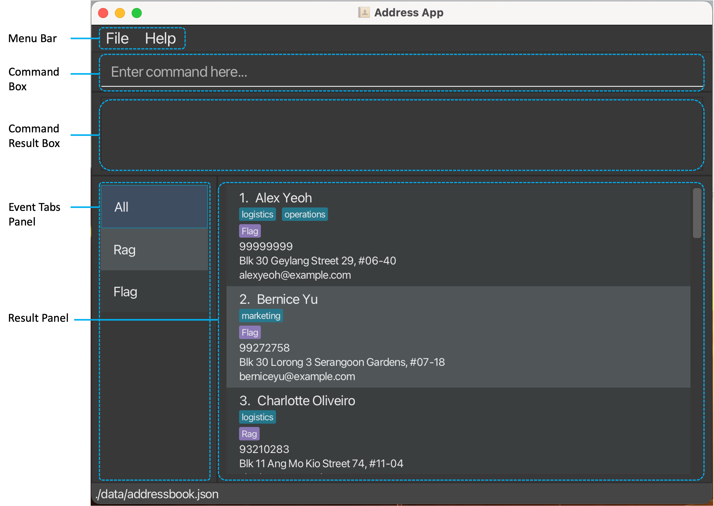

EventBook's GUI consists of 5 main components:

1. Menu Bar
2. Command Box - enter the command you would like to execute here.
3. Command Result Box - displays command success/error messages after commands are executed.
4. Event Tabs Panel - displays all existing Events.
5. Result Panel - displays contact details of members in the particular Event.

### Person

The following details are displayed for each contact in EventBook:

This detailed overview enables users to quickly access essential contact information of their event members.

> [**Note**]
> <br>The default tab on entering the app is the `All` tab, with all contacts in EventBook displayed in the Result
> Panel.

## Try Out Your First Commands!

Ready to dive in? Let's try out a few commands to get you started with EventBook:

1. Open EventBook if you haven't already done so by following the steps outlined in the [Quick Start](#quick-start)
   section.
2. First, let's start with **adding a new contact**. In the command box, type the following command: <br>

```
add n/Xavier Tan p/98765432 e/xavt@example.com a/Ang Mo Kio street 2, Block 123, #01-01
``` 

* This command will add a new contact named "Xavier Tan" with the provided phone number, email address, and address
  details.
* Scroll to the bottom of the list of contacts, you will find that Xavier Tan has been successfully added to your
  contacts!

3. Now, let's **tag** Xavier as the vice-project director `VPD` of the `Flag` event. Enter the following command in the
   command box:

```
assign Xavier Tan t/VPD t/E-Flag
```

* You will see Xavier has been assigned two new tags: a blue `VPD` tag and a purple `Flag` event tag.

4. Next, let's try **switching to the Flag event tab** to view its members. In the command box, type the following
   command: <br>

```
switch Flag
```

* Notice that the highlighted tab on the left switches from the `All` tab to the `Flag` tab, and all listed contacts
  have the `Flag` event tag.

5. To **switch back to the `All` tab** to view all your contacts, enter the following command:

```
list
```

6. Experiment with other basic commands that we have listed in the [Quick Start](#quick-start) section the to get a feel
   for how EventBook works! <br>

Now that you are all warmed up, let's delve deeper into the details of each command and how you can use them to
supercharge your event management in the next section!

--------------------------------------------------------------------------------------------------------------------

## Command Format

**Things to take note of before about the format of commands:**<br>

* Words in `UPPER_CASE` are the parameters to be supplied by the user.<br>
  e.g. in `add n/NAME`, `NAME` is a parameter which can be used as `add n/John Doe`.

* Items in square brackets are optional.<br>
  e.g. `n/NAME [t/TAG]` can be used as `n/John Doe t/friend` or as `n/John Doe`.

* Items with `…`​ after them can be used multiple times including zero times.<br>
  e.g. `[t/TAG]…​` can be used as ` ` (i.e. 0 times), `t/friend` (i.e. 1 time), `t/friend t/family` (i.e. multiple
  times) etc.

* Parameters can be in any order.<br>
  e.g. if the command specifies `n/NAME p/PHONE_NUMBER`, `p/PHONE_NUMBER n/NAME` is also acceptable.

* Extraneous parameters for commands that do not take in parameters (such as `help`, `list`, `exit` and `clear`) will be
  ignored.<br>
  e.g. if the command specifies `help 123`, it will be interpreted as `help`.

> [**Note**]
> <br>If you are using a PDF version of this document, be careful when copying and pasting commands that span multiple
> lines
> as space characters surrounding line-breaks may be omitted when copied over to the application.

## Commands

The EventBook app feature can be broken down into roughly 3 categories - managing events and tags, managing contacts and
general functions, which are all listed below.

## Managing Events and Tags

### Creating a tag : `ctag`

Creates a tag in the address book or an event tag, this allows you to manage or search for people using such tags or
event tags.
The `ctag` function allows you to create tags and events tags separately based on different input formats listed below.

Format 1: `ctag TAG_NAME`

This format allows you to create tags that you can tag your contacts with!

* The provided name has to be a **_unique_** `tag` name that does not already exist in the EventBook.
* The field "TAG_NAME" allows only alphanumerical inputs, eg. `0-9`,`a-z,A-Z`.
* The tag must be a single word.(e.g. `Friends` is allowed but `Good Friends` is forbidden)
* No trailing or extra whitespaces are allowed.

Example: `ctag Friend` creates a tag named `Friend`.

> [**❗WARNING❗**]
> 1. All input fields are necessary.
> 2. If you miss out any of the mandatory fields, or has input the wrong format, your input will get rejected or you
     will get an incorrect result.
> 3. Make sure your TAG_NAME is alphanumerical(`0-9`,`a-z,A-Z`) with no whitespaces in between them.

> [**💡TIP💡**]
> 1. If you want to create a tag with 2 words, consider grouping them together into a single word. For example: "
     SchoolFriends"

Format 2: `ctag t/E-EVENT_NAME dc/Description sd/yyyy-MM-dd HH:mm:ss ed/yyyy-MM-dd HH:mm:ss`

This format allows you to create event tags that you can tag your contacts with! How cool!

* The provided name has to be a **_unique_** `EVENT_NAME` name that does not already exist in the EventBook.
* The field "EVENT_NAME" allows only alphanumerical inputs, eg. `0-9`,`a-z,A-Z`.
* The tag must be a single word.(e.g. `Meeting` is allowed but `Friends Meeting` is forbidden)
* No trailing or extra whitespaces are allowed.

Examples:

* `ctag t/E-orientation dc/Orientation! sd/2024-04-04 02:02:02 ed/2024-04-05 02:02:02`
* Creates an EventTag called orientation that starts from 2024-04-04 02:02:02 to 2024-04-05 02:02:02.

> [**💡TIP💡**]
> 1. If you want to create an event with 2 words, consider grouping them together into a single word. For example: "
     SchoolEvent"

> [**❗WARNING❗**]
> 1. All input fields are necessary.
> 2. If you miss out any of the mandatory fields, or has input the wrong format, your input will get rejected, or you
     will get an incorrect result.
> 3. Make sure your EVENT_NAME is alphanumerical(`0-9`,`a-z,A-Z`) with no whitespaces in between them.

### Deleting a tag : `dtag`

`dtag` deletes an existing tag in the EventBook. This is done to allow you to free up memory space by
deleting tags that you will no longer use, how thoughtful of us:).
This command also deletes this tag from all the contacts in your list.

Format: `dtag TAG_NAME`

* The provided name has to be a  `TAG_NAME` name that already exists in the EventBook.
* The field "TAG_NAME" allows only alphanumerical inputs, eg. `0-9`,`a-z,A-Z`.
* The tag must be a single word.(In fact, you can only create tags with single word inputs.)
* No trailing or extra whitespaces are allowed.
* The provided tag has to exist in the EventBook.

Examples:

* `dtag Friend` Deletes a tag named `Friend`.

> [**💡TIP💡**]
> 1. You can check who is the associated with the tag you are deleting by using the [Search](#searching-by-tag--search)
     command.

> [**NOTE**]  
> If you delete a tag that does not exist, you will get notified by a warning that it does not exist. You will get a
> success message when you delete an existing tag too.

> [**❗WARNING❗**]
> All input fields are necessary.
> This tag will be removed from **every** contact tagged with it. This action is also **not** reversible.
> Make sure your `TAG_NAME` is alphanumerical(`0-9`,`a-z,A-Z`) with no whitespaces in between them.

### Deleting an EventTag : `devent`

This command Deletes an event tag for you. Convenient to do so what an event is over, right?
Take note that this command also deletes this event tag from all the contacts that are associated with it.

Format: `devent EVENT_TAG`

* The provided name has to be an `EVENT_TAG` name that already exists in the EventBook.
* The field "EVENT_TAG" allows only alphanumerical inputs, eg. `0-9`,`a-z,A-Z`.
* The event tag must be a single word.(In fact, you can only create event tags with single word inputs.)
* No trailing or extra whitespaces are allowed.
* The provided event tag has to exist in the EventBook.

Examples:

* `devent bonfire` Deletes an EventTag named `bonfire`.

> [**💡TIP💡**]
> You can do a quick check of who is using the event by using the [Switch](#switching-between-events--switch), do take
> note that the event panel at the left of the GUI is not clickable.

> [**❗WARNING❗**]
> Make sure your `EVENT_NAME` is alphanumerical(`0-9`,`a-z,A-Z`) with no whitespaces in between them.

> [**NOTE**]  
> If you delete an event tag that does not exist, you will get notified by a warning that says it does not exist. You
> will get a success message after deleting an existing tag.
> The event GUI on the left of the screen will update when you delete an existing event.
> This event tag will be removed from **every** contact tagged with it. This action is also **not** reversible.

### Assigning a tag : `assign`

Assign someone with a tag so to group them conveniently! For example, you can assign a new friend you meet in school
with
the tags 'school' and 'friend'!

Format: `assign (NAME or INDEX) t/TAG…​` or `assign (NAME or INDEX) t/E-EVENT_TAG…​`

* Assign the person at the specified `INDEX` or `NAME` with the tag `TAG` or with the event tag `EVENT_TAG`.
* The index refers to the index number shown in the displayed person list. The index **must be a positive integer** 1,
  2, 3, …​
* The provided tag(s) and event tag(s) have to exist in the EventBook.
* No trailing or extra whitespaces are allowed.

Examples:

* `assign 1 t/friends` Assigns the first person in the list to a tag named `Friends`.
* `assign John Doe t/E-event1` Assigns the person named John Doe in the list to an Event Tag named `event1`.

> [**💡TIP💡**]
> <br>If you do not have the tag or event tag you are assigning a person with, you can create them with
> the [ctag](#creating-a-tag--ctag) command.

> [**❗WARNING❗**]
> <br>The name refers to the name shown in the displayed person list. The name must be **exactly** what is shown in the
> displayed person list.
> For example, `assign John Doe t/friends` instead of `assign John t/friends`.

### Searching by tag : `search`

Displays all the people that are tagged with `TAG_NAME`. We know that to search for a list people who are tagged as *
*Friend**,
you are tempted to do `search Friends`, plural. However, this is not supported:(.

Format: `search TAG_NAME`

* The search is case-sensitive.
* The provided tag has to exist in the EventBook.

Examples:

* `search Friend` Displays all people tagged as `Friend`.

> [**💡TIP💡**]
> <br>After searching, you can reset the app to display all the contacts with the [list](#listing-all-persons--list)
> command by typing list in the command box.

### Switching between events : `switch`

Format: `switch EVENT_NAME`

Switches to tab with EVENT_TAG_NAME.

* The search is case-sensitive.
* The default tab is the `All` tab with full list of contacts displayed.

> [**💡TIP💡**]
> <br>After searching, you can reset the app to display all the contacts with the [list](#listing-all-persons--list)
> command by typing list in the command box.

### Viewing help : `help`

Shows a message explaining how to access the help page.


Format: `help`

### Adding a person: `add`

Adds a person to the address book.

Format: `add n/NAME p/PHONE_NUMBER e/EMAIL a/ADDRESS [t/TAG]…​`

> [**💡TIP💡**]
> <br>A person can have any number of tags (including 0)


Examples:

* `add n/John Doe p/98765432 e/johnd@example.com a/John street, block 123, #01-01`
* `add n/Betsy Crowe t/friend e/betsycrowe@example.com a/Newgate Prison p/1234567 t/criminal`

### Listing all persons : `list`

Shows a list of all persons in the address book.

Format: `list`

### Editing a person : `edit`

Edits an existing person in the address book.

Format: `edit (NAME or INDEX) [n/NAME] [p/PHONE] [e/EMAIL] [a/ADDRESS] [t/TAG]…​`

* Edits the person at the specified `INDEX` or `NAME`.
* The index refers to the index number shown in the displayed person list. The index **must be a positive integer** 1,
  2, 3, …​
* The name refers to the name shown in the displayed person list. The name must be **exactly** what is shown in the
  displayed person list.
* For example, `edit John Doe t/friends` instead of `edit John t/friends`.
* At least one of the optional fields must be provided.
* Existing values will be updated to the input values.
* When editing tags, the existing tags of the person will be removed i.e. adding of tags is not cumulative.
* You can remove all the person’s tags by typing `t/` without
  specifying any tags after it.

Examples:

* `edit 1 p/91234567 e/johndoe@example.com` Edits the phone number and email address of the 1st person to be `91234567`
  and `johndoe@example.com` respectively.
* `edit Ben n/Betsy Crower t/` Edits the person named Ben to be `Betsy Crower` and clears all existing tags.
* `edit 2 n/Betsy Crower t/` Edits the name of the 2nd person to be `Betsy Crower` and clears all existing tags.

Examples:

* `search Flag` Switches to 'Flag' event tab and shows all members tagged with 'Flag' event tag.

### Locating persons by name: `find`

Finds persons whose names contain any of the given keywords.

Format: `find KEYWORD [MORE_KEYWORDS]`

* The search is case-insensitive. e.g. `hans` will match `Hans`
* The order of the keywords does not matter. e.g. `Hans Bo` will match `Bo Hans`
* Only the name is searched.
* Only full words will be matched e.g. `Han` will not match `Hans`
* Persons matching at least one keyword will be returned (i.e. `OR` search).
  e.g. `Hans Bo` will return `Hans Gruber`, `Bo Yang`

Examples:

* `find John` returns `john` and `John Doe`
* `find alex david` returns `Alex Yeoh`, `David Li`<br>
  

### Deleting a person : `delete`

Deletes the specified person from the address book.

Format: `delete (NAME or INDEX)`

* Deletes the person at the specified `INDEX` or `NAME`.
* The index refers to the index number shown in the displayed person list. The index **must be a positive integer** 1,
  2, 3, …​
* The name refers to the name shown in the displayed person list. The name must be **exactly** what is shown in the
  displayed person list.
* For example, `delete John Doe` instead of `delete John`.

Examples:

* `list` followed by `delete 2` deletes the 2nd person in the address book.
* `list` followed by `delete John Doe` deletes the person named 'John Doe' in the address book.

### Clearing all entries : `clear`

Clears all entries from the address book.

Format: `clear`

### Importing contacts from .csv : `import`

Imports all contacts from given file path (default ./import/import.csv)

Format: `import f/PATH`

* Requires a valid file to be given in the PATH variable
* If PATH is left empty (i.e. `import f/`) the default file referenced is ./import/import.csv
* The format of the first line of the csv should be:
  `NAME,NUMBER,EMAIL,ADDRESS,EVENTS,TAGS`
* There should be no trailing empty characters (' ') in any cell.
* The titles are non-caps sensitive (`Name` pr `NaME` would also be valid)
* The format of each parameter should follow the appropriate add command format.
* There should be no blank lines, and no conflicts with contacts in the existing address book
* The `EVENTS` portion must satisfy one of the following format requirements:
    1. `N/A` if the contact is not in any events, else a field error will occur
    2. `t/E-eventName dc/Description sd/yyyy-MM-dd HH:mm:ss ed/yyyy-MM-dd HH:mm:ss` for the first instance of each
       unique event, unless said tag already exists in the address book, in which case iii. can be used
    3. `t/E-eventName` for existing events or previously declared events
        * e.g. If the first contact has `t/E-orientation dc/Orientation! sd/2024-04-04 02:02:02 ed/2024-04-05 02:02:02`,
          then further contacts may simply have `t/E-orientation` under the `EVENTS` fields
* The `TAGS` and `EVENTS` portion accept multiple tags delimited by the `|` character (e.g. Friend|Colleague). A
  consequence of this is that tags containing `|` in their name cannot be imported
* Ensure that the file provided is saved before used as an import file
* The default download contains a sample .csv file that one can refer to

Examples:

* `import f/./import/import.csv` imports the contacts from the specified file

### Exporting contacts from address book : `export`

Exports all contacts to ./export/export.csv

Format: `export`

* Note that moving files around may cause export to fail. If one relocates the source files, one must
  ensure that the ./export directory exists for the export.csv to generate at
* If a file export.csv is already present at ./export, it will be overwritten with the
  current address book data
* The export file format is the same as the output format given in `import`

### Exiting the program : `exit`

Exits the program.

Format: `exit`

### Saving the data

EventBook data are saved in the hard disk automatically after any command that changes the data. There is no need to
save manually.

### Editing the data file

EventBook data are saved automatically as a JSON file `[JAR file location]/data/addressbook.json`. Advanced users are
welcome to update data directly by editing that data file.


> [**❗WARNING❗**]
> <br>If your changes to the data file makes its format invalid, EventBook will discard all data and start with an empty
> data file at the next run. Hence, it is recommended to take a backup of the file before editing it.<br>
> Furthermore, certain edits can cause the EventBook to behave in unexpected ways (e.g., if a value entered is outside
> the acceptable range). Therefore, edit the data file only if you are confident that you can update it correctly.

### Archiving data files `[coming in v2.0]`

_Details coming soon ..._

--------------------------------------------------------------------------------------------------------------------

## Setting Up Your First Event!

This section would guide you through some basic commands of EventBook, and how to use them to set up your first event
with contacts and tags.

### Clear sample data

To start, if you want to remove the sample contacts in the EventBook, you can use the `clear` command to clear
everything!
Simply type `clear` in the text box at the top of the app! (Do take note that throughout this tutorial, we will not
clear the
sample contacts for the convenience doing demo.)

> [**💡TIP💡**]
> 1. Input `clear`. 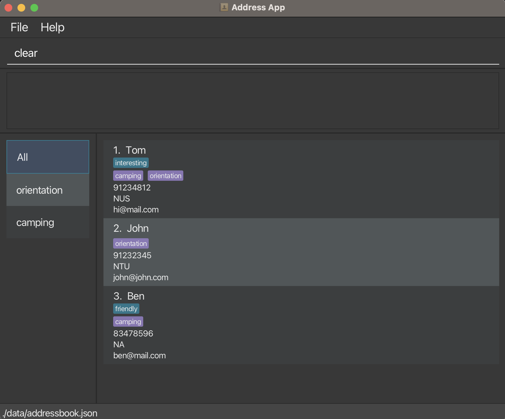
> 2. Success! 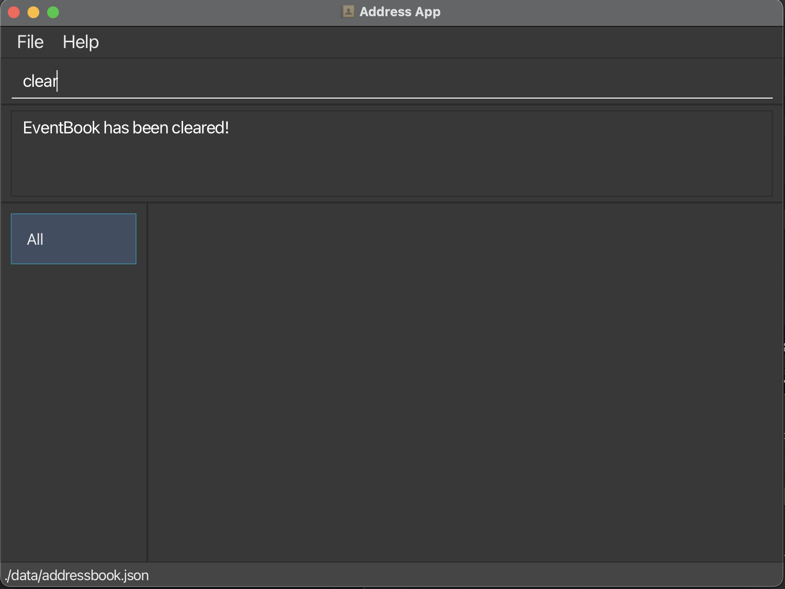

### Create a tag with ctag

To tag a person as a friend or any tag you want, you need to first create the tag.
To start, create a tag called `penpal`. Do take not tags are alphanumerical, so you cannot do `pen-pal` unfortunately.
> [**💡TIP💡**]
> 1. Input `ctag penpal`. 
> 2. Success! 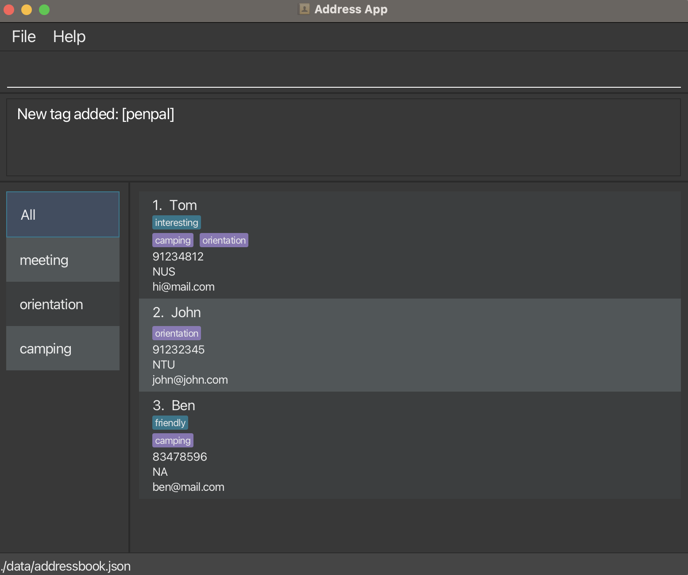

### Tag a person with assign

To finally tag the person who is your pen-pal, we use the assign command.
> [**💡TIP💡**]
> 1. Assign the person of interest with your tag! For this example,
     we assign John as our pen-pal with `assign penpal`. 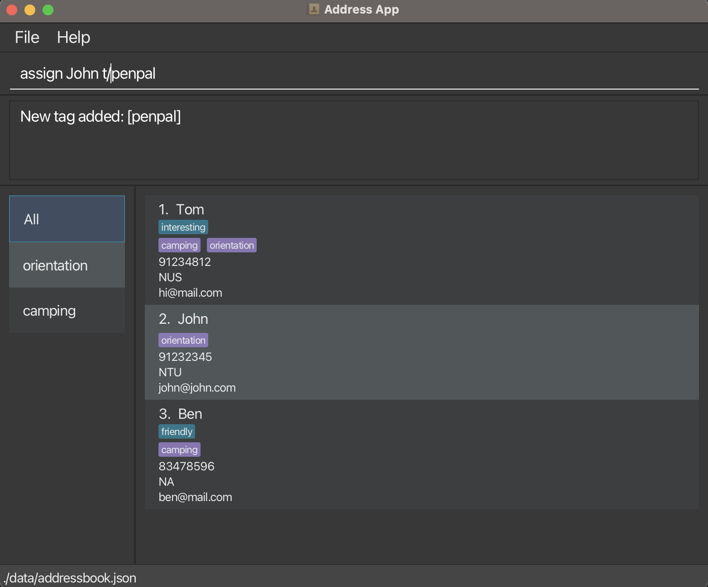
> 2. Success! 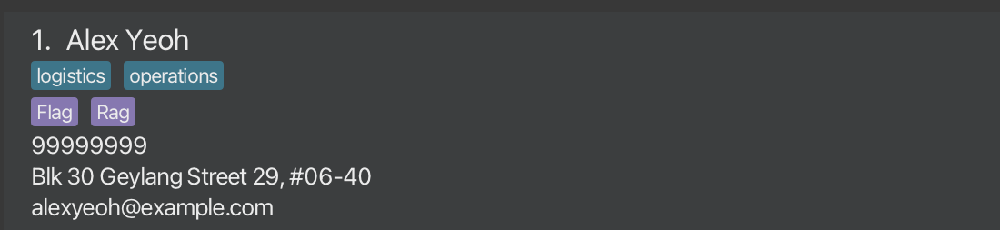

### Search Tag

You may want to say, what if I don't remember how many pen-pal, or, how many friends I have in my contact?
No worries, you can use the search command to find out!

> [**💡TIP💡**]
> 1. Search for pen-pals using the search command `search penpal`. 
> 2. Success! 
> 3. To see all the existing contacts again, type `list` in the input box to reset everything!

### Delete Tag

Oh no, what if I want to delete a tag that I no longer use? No worries, you can use the `dtag` command!
This command removes the tag you delete for all your contacts so be careful!

> [**💡TIP💡**]
> 1. Delete the existing `penpal` tag using the dtag command `dtag penpal`. 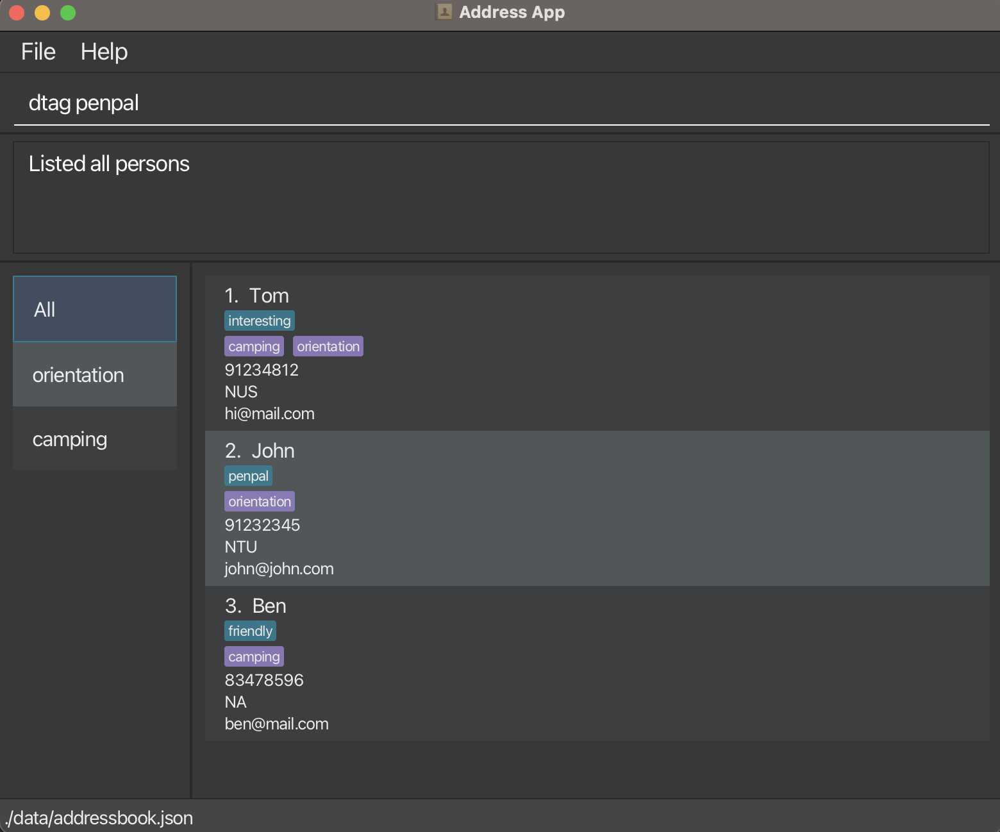
> 2. Success! 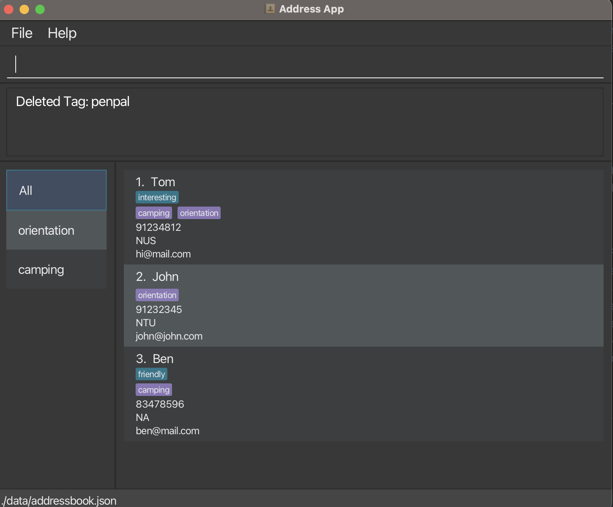

### Create an event

Ok, what if you have an event that you need to group people to, like a meeting on 9 Feb from 8 to 9pm? No worries, you
can assign people to events
and manage them as well. But first, you should create an event first with `ctag`.

> [**💡TIP💡**]
> 1. Create an event called **meeting** from 9 Feb 8p.m to 9p.m with
     the
     command `ctag t/E-meeting dc/meeting for work! sd/2024-02-09 20:00:00 ed/2024-02-09 20:00:00`. 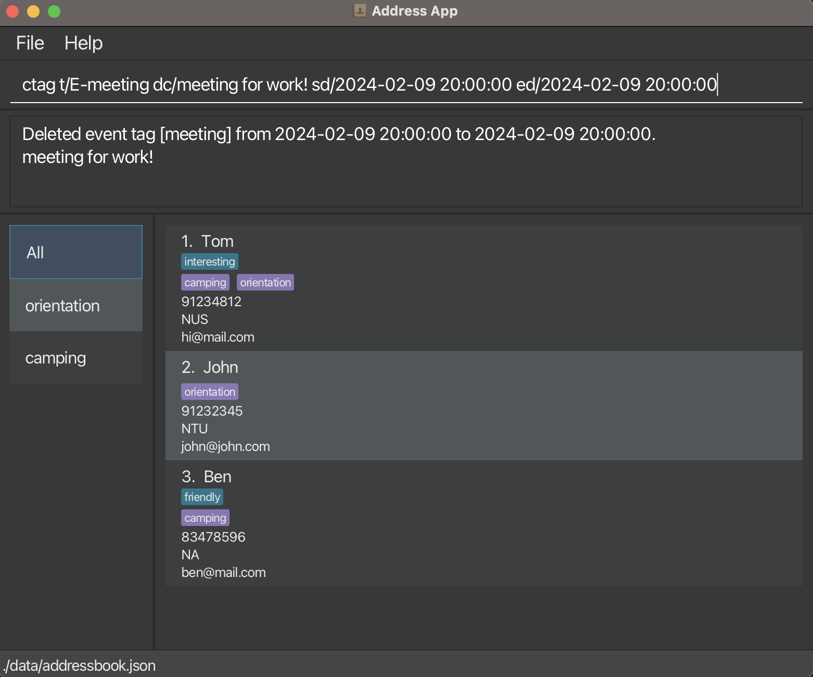
> 2. Success! 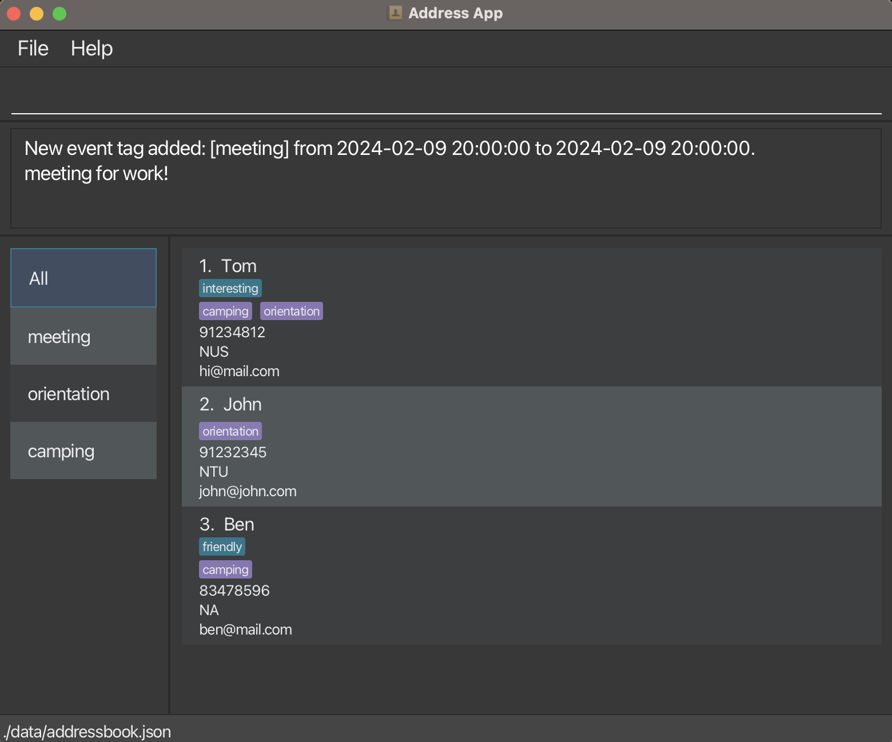

### Assign a person to the event

Now you want to assign a person to the event meeting.(A.k.a a person is in the meeting). You can do it with the
`assign` command.

> [**💡TIP💡**]
> 1. Assign John with meeting using `assign John t/E-meeting`. 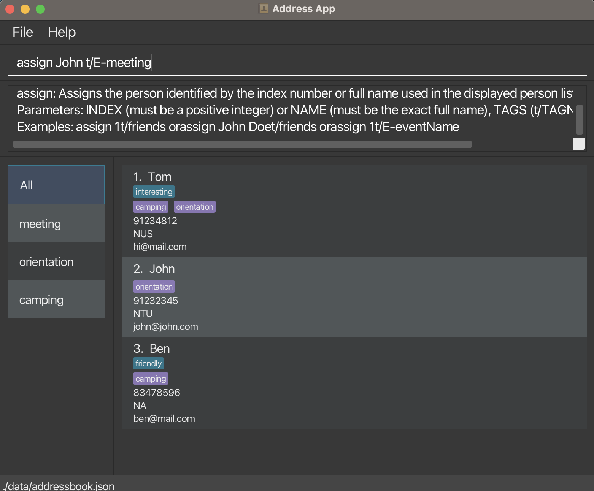
> 2. Success! 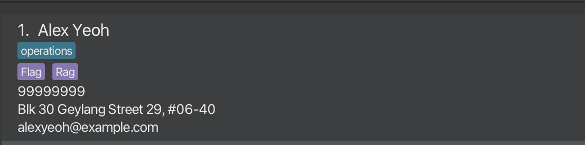

### To find particulars of an event.

Ok, I want to check who is in an event or the event details, how can I do it?
No worries pal, we got you covered. To figure out who is in any event, use the `switch` command.

> [**💡TIP💡**]
> 1. Figure out who is in the event **meeting** and the time and description of meeting,
     use `switch meeting`. 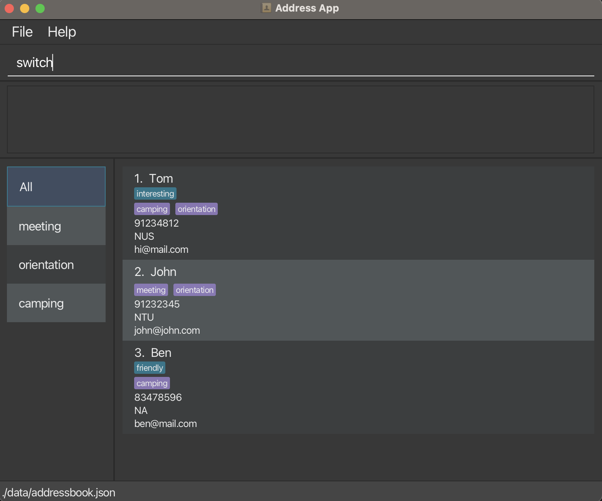
> 2. Success! 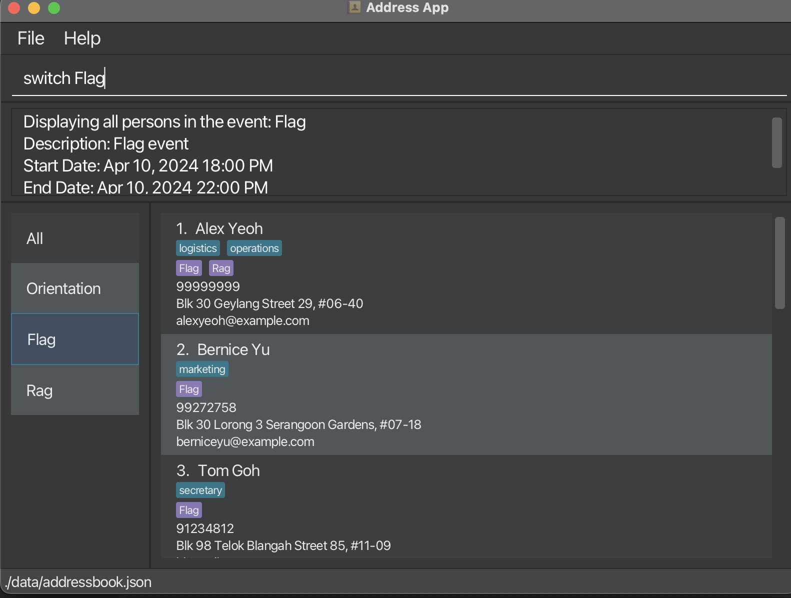
> 3. To display all contacts again, use `list` by inputing `list` in the input box.


--------------------------------------------------------------------------------------------------------------------

## FAQ

**Q**: How do I transfer my data to another Computer?<br>
**A**: Install the app in the other computer and overwrite the empty data file it creates with the file that contains
the data of your previous AddressBook home folder.

--------------------------------------------------------------------------------------------------------------------

## Known issues

1. **When using multiple screens**, if you move the application to a secondary screen, and later switch to using only
   the primary screen, the GUI will open off-screen. The remedy is to delete the `preferences.json` file created by the
   application before running the application again.
2. When giving enormously long inputs such as long tag/event tag names, the tag will not get fully displayed by the app.

--------------------------------------------------------------------------------------------------------------------

## Command summary

| Action              | Format, Examples                                                                                                                                                                             |
|---------------------|----------------------------------------------------------------------------------------------------------------------------------------------------------------------------------------------|
| **Add**             | `add n/NAME p/PHONE_NUMBER e/EMAIL a/ADDRESS [t/TAG]…​` <br> e.g., `add n/James Ho p/22224444 e/jamesho@example.com a/123, Clementi Rd, 1234665 t/friend t/colleague`                        |
| **Assign**          | `assign (NAME or INDEX) [t/TAG]…​` or `assign (NAME or INDEX) [t/E-TAG]…​` <br> e.g.,`assign 2 t/tag1` or `assign John Doe t/E-event1`                                                       |
| **Clear**           | `clear`                                                                                                                                                                                      |
| **Delete**          | `delete (NAME or INDEX)` <br> e.g., `delete 3` or `delete John Doe`                                                                                                                          |
| **Edit**            | `edit (NAME or INDEX) [n/NAME] [p/PHONE_NUMBER] [e/EMAIL] [a/ADDRESS] [t/TAG]…​` <br> e.g., `edit 2 n/James Lee e/jameslee@example.com` or`edit John Doe n/James Lee e/jameslee@example.com` |
| **Find**            | `find KEYWORD [MORE_KEYWORDS]`<br> e.g., `find James Jake`                                                                                                                                   |
| **List**            | `list`                                                                                                                                                                                       |
| **Help**            | `help`                                                                                                                                                                                       |
| **Create Tag**      | `ctag TAG_NAME` <br> e.g., `ctag Friend`                                                                                                                                                     |
| **Create EventTag** | `ctag t/E-eventName dc/ Description sd/yyyy-MM-dd HH:mm:ss ed/yyyy-MM-dd HH:mm:ss` <br> e.g., `ctag t/E-orientation dc/Orientation! sd/2024-04-04 02:02:02 ed/2024-04-05 02:02:02`           |
| **Delete Tag**      | `dtag TAG_NAME` <br> e.g., `dtag Friend`                                                                                                                                                     |
| **Delete Event**    | `devent EVENT_TAG_NAME` <br> e.g., `devent fire`                                                                                                                                             |
| **Import**          | `import f/PATH` <br> e.g., `import f/./import/import.csv`                                                                                                                                    |
| **Export**          | `export`                                                                                                                                                                                     |
| **Search Tag**      | `search TAG_NAME` <br> e.g., `search Friend`                                                                                                                                                 |
| **Switch**          | `switch EVENT_TAG_NAME` <br> e.g. `switch Flag`                                                                                                                                              |
